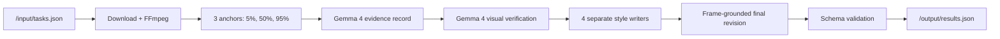

# ClioGemma - slide deck brief

Create a polished 7-8 slide deck about how the project works. Focus on the
problem, user value, architecture, and reproducibility. Do not make the deck a
leaderboard-results report.

## Core message

**ClioGemma separates seeing from writing: Gemma verifies what happened first,
then expresses the same evidence in four distinct voices.**

## Slide plan

### 1. Title

- ClioGemma
- Evidence-first video captioning with Gemma
- AMD Developer Hackathon ACT II - Track 2

Visual: one video strip branching into four caption cards.

### 2. The challenge

One clip must produce four tones without changing the facts:

- formal
- sarcastic
- humorous-tech
- humorous-non-tech

Emphasize that style creativity and factual grounding pull in opposite
directions.

### 3. Product flow

1. Receive a video task.
2. Sample four chronological moments.
3. Build and verify a factual record.
4. Write each requested style separately.
5. Recheck captions against the images.
6. Return evaluator-ready JSON.

### 4. Architecture

Callouts: Novita-only, Gemma-only, no separate judge, Linux/amd64, bounded
runtime.

### 5. Grounding design

Show the structured evidence fields:

- scene
- subjects
- stable facts
- beginning / middle / end
- caption anchor
- clearly readable text
- do-not-claim ledger

Explain that the negative ledger is as important as the visible facts because
it blocks inferred motives, identities, locations, counts, and unseen outcomes.

### 6. Four voices, one event

Use one real example and show four short caption cards. The literal subject and
action should remain recognizable in all four while the sentence shape and
tone change.

### 7. Built for the evaluator

- public Linux/amd64 Docker image
- exact `/input/tasks.json` to `/output/results.json` contract
- requested keys only
- two concurrent clips
- bounded provider calls and 570-second global limit
- no hardcoded test-video answers
- public Streamlit demo is separate from the scoring entrypoint

### 8. Close

Headline: **See carefully. Verify twice. Write with personality.**

Include the GitHub repository, demo URL, and public image reference.

## Design direction

- Use the existing black, ivory, and gold ClioGemma visual identity.
- Keep body text short; prefer diagrams, caption cards, and frame strips.
- Use gold for evidence/verification and distinct restrained colors for the
  four style cards.
- Use monospace only for paths, model IDs, and JSON keys.
- Keep the emblem small and crisp; do not place decorative artifacts in the
  top-left corner.

## Claims to avoid

- Do not claim a score above 0.92 unless the exact image digest receives it.
- Do not describe the older 0.68 image as the current architecture.
- Do not claim Claude, Kimi, Gemini, Fireworks, Whisper, or an external judge
  is used in production.
- Do not expose credentials.

## Source files

- `README.md`
- `docs/CURRENT_RELEASE_REVIEW.md`
- `docs/SUBMISSION_FORM_COPY.md`
- `Dockerfile`
- `app/visual.py`
- `app/evidence_pipeline.py`
