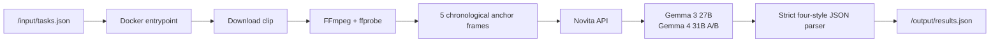

# ClioGemma — PPT Brief for a Slide-Deck Agent

## Purpose

Create a concise, polished 7–9 slide presentation for AMD Developer Hackathon
ACT II, Track 2: Video Captioning. The deck should make the project easy to
understand, technically credible, and honest about what has and has not been
measured.

## Core message

**ClioGemma turns one short video into four grounded captions in a reproducible,
AMD-compatible Docker container.** It uses Novita-hosted Google Gemma
multimodal inference, chronological visual evidence, strict JSON output, and
bounded runtime controls.

## Audience and judging context

- Track 2 asks for four styles: formal, sarcastic, humorous-tech, and
  humorous-non-tech.
- The attached Participant Guide is the controlling technical contract.
- The container reads `/input/tasks.json` and writes `/output/results.json`.
- Hidden clips are unseen by the agent; do not imply hardcoded answers.
- The Gemma prize matters: present Gemma as the central model family.

## Slide-by-slide plan

### Slide 1 — Title

Title: **ClioGemma**

Subtitle: **Evidence-first video captioning with Gemma**

Small footer: AMD Developer Hackathon ACT II · Track 2 · Video Captioning

Visual: a horizontal video strip transforming into four caption cards. Use a
clean blue/teal AMD-compatible technology aesthetic with a warm accent for the
humorous styles.

### Slide 2 — The problem

Headline: **One video, four very different communication goals**

Show four cards:

- Formal: objective and factual
- Sarcastic: accurate with dry irony
- Humorous-tech: accurate with one technology analogy
- Humorous-non-tech: accurate with an everyday analogy

Speaker point: style must change without changing the visible facts.

### Slide 3 — The solution

Headline: **Ground the facts first, then change the voice**

Three short steps:

1. Sample the video at five chronological anchor points.
2. Ask one Gemma vision call for all four styles in structured JSON.
3. Validate the schema and emit a deterministic, evaluator-ready result.

Include a small example showing one visible scene branching into the four
styles. Use labels such as “same evidence” and “different voice.”

### Slide 4 — Architecture

Headline: **Small, bounded, reproducible production path**

Use this diagram as the source for the visual:

Callouts:

- Novita-only provider lock
- Gemma-only model allowlist
- No embedded judge
- Parallel clip processing
- Linux/amd64 image

### Slide 5 — Grounding and style controls

Headline: **The prompt is designed to reduce hallucination before it reaches JSON**

Show a checklist:

- Visible subject, action/state, and setting first
- No invented identities, locations, brands, counts, motives, audio, or future
  events
- No treating a hand near an object as proof of a completed action
- Same literal visual anchor across all styles
- Silent final verification before returning JSON

### Slide 6 — Reliability and submission contract

Headline: **Built for the evaluator, not a demo-only path**

Show the contract:

- Reads `/input/tasks.json`
- Writes valid `/output/results.json`
- Returns every requested style
- `linux/amd64` Docker image
- Five frames per clip by default
- Three clips processed concurrently
- 25-second model request timeout
- 125-second per-clip budget
- 570-second global budget

### Slide 7 — Evidence and current status

Headline: **Verified locally; leaderboard measurement is next**

Use only these metrics:

- `3 passed` release contract tests
- `linux/amd64` image build passed
- Novita Gemma 3 27B one-clip smoke: four non-empty styles in ~7.3 seconds
- Historical Gemma-only development proxy: approximately `0.871`

Add a clear footnote: **The current AMD leaderboard score has not yet been
measured for this reconstructed release. Do not claim 0.92 or 0.95 in the deck.**

### Slide 8 — Demo flow

Headline: **From task file to four captions**

60-second narration:

1. Show one input task and the short video.
2. Show five sampled frames.
3. Show the Gemma structured response.
4. Show the four final captions.
5. Show the output JSON path and Docker command.

End with: **Same evidence. Four voices. One reproducible container.**

### Slide 9 — Roadmap / close

Headline: **A measured path to higher quality**

Near-term experiments, one variable at a time:

- Gemma 3 27B with 4, 5, and 8 anchors
- Gemma 4 31B only if request latency stays below the guide limit
- Compare returned AMD scores across up to 10 submissions per hour
- Preserve the best public image tag and record the result

Close with the project title and public repository/image placeholders.

## Design direction

- Use a dark navy or deep teal base with white text and electric blue accents.
- Use four distinct caption colors, one per style, but keep the formal style
  visually restrained.
- Prefer diagrams, short labels, and one concrete example over paragraphs.
- Use monospace styling for paths, JSON keys, Docker commands, and model IDs.
- Keep slides readable at presentation distance; no dense source-code blocks.
- Include alt text or speaker notes for architecture diagrams.

## Claims the deck must not make

- Do not claim a current score above `0.91`.
- Do not claim `0.92`, `0.95`, or first place before the evaluator confirms it.
- Do not claim audio transcription, external self-evaluation, Claude, Gemini,
  Fireworks, or a second provider in the production image.
- Do not say the project uses a local judge. The platform judge is external.
- Do not show or mention API keys.
- Do not imply the historical `0.871` proxy is an official leaderboard score.

## Source files for the slide agent

- `README.md` — public-facing build and model summary
- `docs/CURRENT_RELEASE_REVIEW.md` — authoritative architecture, compliance,
  score caveats, and submission ladder
- `docs/SUBMISSION_FORM_COPY.md` — exact platform field copy
- `Dockerfile` — container contract and runtime defaults
- `app/visual.py` — batch runner and JSON output behavior
- `app/evidence_pipeline.py` — prompt and Gemma call path
